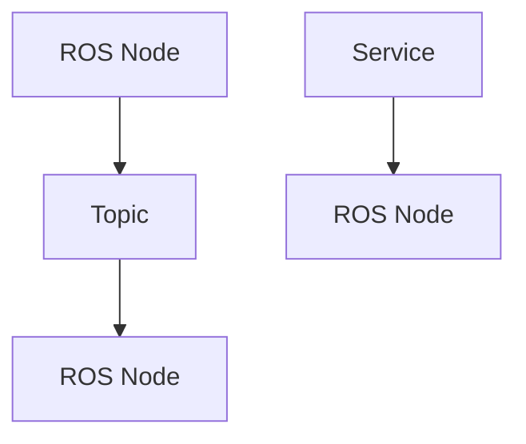

# Quickstart Guide: Physical AI & Humanoid Robotics Textbook

## Prerequisites

Before starting development, ensure you have:

- Node.js v18+ installed
- npm or yarn package manager
- Git for version control
- A code editor (VS Code recommended)

## Setup Instructions

### 1. Clone the Repository

```bash
git clone <repository-url>
cd physical-ai-textbook
```

### 2. Install Dependencies

```bash
npm install
```

### 3. Start Development Server

```bash
npm start
```

This will start the Docusaurus development server at `http://localhost:3000`.

## Project Structure

```
physical-ai-textbook/
├── docs/                 # Textbook content organized by modules/weeks
│   ├── module-1/
│   │   ├── week-1/
│   │   ├── week-2/
│   │   └── ...
│   ├── module-2/
│   │   └── ...
│   └── ...
├── src/                  # Custom React components
│   ├── components/       # Reusable components
│   ├── css/              # Custom styles
│   └── pages/            # Custom pages
├── static/               # Static assets (images, diagrams)
├── docusaurus.config.js  # Docusaurus configuration
├── package.json          # Project dependencies
└── sidebars.js           # Navigation configuration
```

## Adding Content

### Creating a New Week's Content

1. Create a new directory in the appropriate module:
   ```
   docs/module-1/week-3/
   ```

2. Add your content as MDX files:
   ```
   docs/module-1/week-3/introduction.mdx
   docs/module-1/week-3/ros-architecture.mdx
   ```

3. Update `sidebars.js` to include your new content in the navigation.

### Adding Code Examples

Use the following syntax to add code examples with syntax highlighting:

```md
import Tabs from '@theme/Tabs';
import TabItem from '@theme/TabItem';

<Tabs>
<TabItem value="python" label="Python">

```python
import rclpy
from rclpy.node import Node

class MinimalPublisher(Node):
    def __init__(self):
        super().__init__('minimal_publisher')
        self.publisher = self.create_publisher(String, 'topic', 10)
```

</TabItem>
<TabItem value="cpp" label="C++">

```cpp
#include <rclcpp/rclcpp.hpp>

class MinimalPublisher : public rclcpp::Node
{
public:
  MinimalPublisher() : Node("minimal_publisher") {
    publisher_ = this->create_publisher<std_msgs::msg::String>("topic", 10);
  }
```

</TabItem>
</Tabs>
```

### Adding Diagrams

Use Mermaid diagrams directly in your MDX files:

```md

```

## Configuration

### Search Setup

The project uses Algolia DocSearch. To configure:

1. Update the `themeConfig.algolia` section in `docusaurus.config.js` with your search parameters
2. Submit your site to [Algolia DocSearch](https://docsearch.algolia.com/) to get the API key

### Navigation

Update `sidebars.js` to modify the textbook navigation structure:

```js
module.exports = {
  textbook: [
    {
      type: 'category',
      label: 'Module 1: The Robotic Nervous System',
      items: [
        {
          type: 'category',
          label: 'Week 1',
          items: ['module-1/week-1/introduction', 'module-1/week-1/ros-concepts'],
        },
        // ... more weeks
      ],
    },
    // ... more modules
  ],
};
```

## Building for Production

```bash
npm run build
```

This creates a `build/` directory with the static site that can be deployed to any static hosting service.

## Deployment

### GitHub Pages

The project is configured for GitHub Pages deployment. To deploy:

1. Ensure your repository is set up for GitHub Pages
2. Run the build command: `npm run build`
3. The site will be automatically deployed via GitHub Actions

### Custom Domain

To use a custom domain:

1. Add a `CNAME` file in the `static/` directory with your domain
2. Configure your DNS settings to point to GitHub Pages