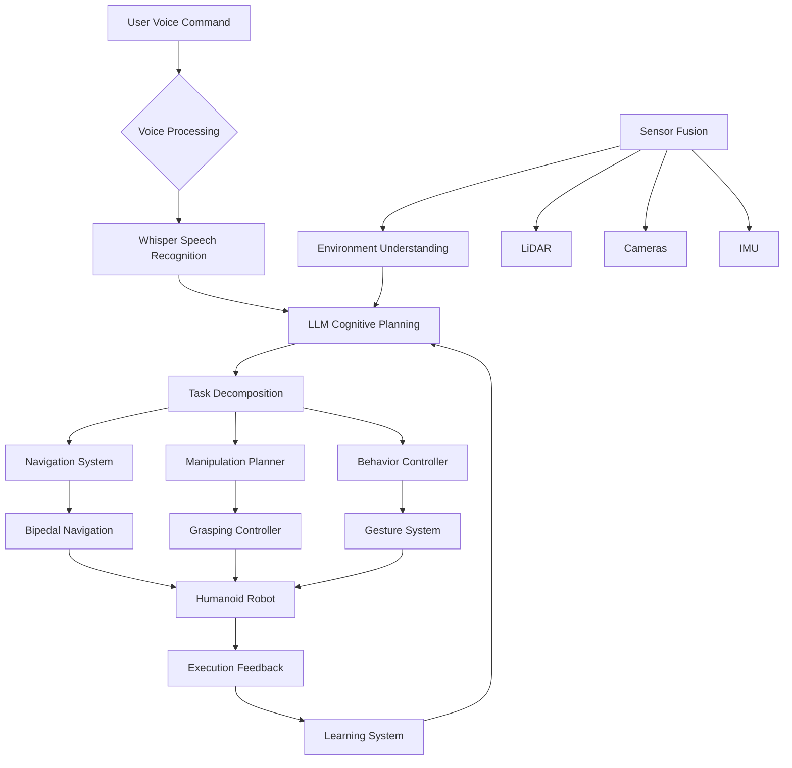

# Week 13: Capstone Project - Autonomous Humanoid

## Learning Objectives

By the end of this week, you will be able to:
- Integrate all modules learned throughout the course into a cohesive system
- Implement a complete autonomous humanoid robot application
- Demonstrate advanced capabilities combining ROS 2, simulation, AI, and VLA
- Evaluate and present your autonomous humanoid system
- Document lessons learned and future improvements

## Introduction to the Capstone Project

The capstone project represents the culmination of your learning journey in Physical AI & Humanoid Robotics. You will create a complete autonomous humanoid system that integrates all the technologies covered in the previous 12 weeks: ROS 2 communication, simulation environments, NVIDIA Isaac tools, and Vision-Language-Action capabilities.

### Project Scope
Your autonomous humanoid should demonstrate:
- **Perception**: Understanding the environment through multiple sensors
- **Cognition**: High-level reasoning and planning using LLMs
- **Action**: Physical execution of tasks with proper gait and balance
- **Interaction**: Natural communication through voice and gestures

## Project Architecture

### System Integration Overview


### Complete System Node Structure
```python
# autonomous_humanoid.py - Complete autonomous humanoid system
import rclpy
from rclpy.node import Node
from std_msgs.msg import String, Bool
from sensor_msgs.msg import Image, LaserScan, Imu, JointState
from geometry_msgs.msg import PoseStamped, Twist
from nav_msgs.msg import Odometry
import json
import threading
import time

class AutonomousHumanoid(Node):
    def __init__(self):
        super().__init__('autonomous_humanoid')

        # Initialize all subsystems
        self.initialize_perception()
        self.initialize_cognition()
        self.initialize_action()
        self.initialize_interaction()

        # State management
        self.system_state = 'IDLE'  # IDLE, LISTENING, PLANNING, EXECUTING, ERROR
        self.current_task = None
        self.task_queue = []

        # Publishers
        self.state_pub = self.create_publisher(String, 'system_state', 10)
        self.task_pub = self.create_publisher(String, 'current_task', 10)

        # Timer for state management
        self.state_timer = self.create_timer(0.1, self.state_machine)

        self.get_logger().info('Autonomous Humanoid System initialized')

    def initialize_perception(self):
        """Initialize perception subsystem"""
        # Subscribe to all sensor data
        self.create_subscription(Image, 'camera/image_raw', self.camera_callback, 10)
        self.create_subscription(LaserScan, 'scan', self.lidar_callback, 10)
        self.create_subscription(Imu, 'imu/data', self.imu_callback, 10)
        self.create_subscription(Odometry, 'odom', self.odom_callback, 10)
        self.create_subscription(JointState, 'joint_states', self.joint_callback, 10)

        # Perception data storage
        self.latest_image = None
        self.latest_scan = None
        self.imu_data = None
        self.odom_data = None
        self.joint_data = None

        self.get_logger().info('Perception subsystem initialized')

    def initialize_cognition(self):
        """Initialize cognition subsystem"""
        # Subscribe to voice commands
        self.create_subscription(String, 'voice_commands', self.voice_command_callback, 10)

        # Initialize LLM interface
        from llm_interface import LLMInterface
        self.llm_planner = LLMInterface(api_key="your-api-key")

        # Initialize task planner
        from hierarchical_planning import HierarchicalPlanner
        self.hierarchical_planner = HierarchicalPlanner()

        # Initialize context manager
        from context_management import ContextManager
        self.context_manager = ContextManager()

        self.get_logger().info('Cognition subsystem initialized')

    def initialize_action(self):
        """Initialize action subsystem"""
        # Publishers for robot control
        self.cmd_vel_pub = self.create_publisher(Twist, 'cmd_vel', 10)
        self.joint_cmd_pub = self.create_publisher(JointState, 'joint_commands', 10)
        self.nav_goal_pub = self.create_publisher(PoseStamped, 'move_base_simple/goal', 10)

        # Subscribe to execution feedback
        self.create_subscription(String, 'execution_feedback', self.execution_feedback_callback, 10)
        self.create_subscription(Bool, 'execution_complete', self.execution_complete_callback, 10)

        self.get_logger().info('Action subsystem initialized')

    def initialize_interaction(self):
        """Initialize interaction subsystem"""
        # Publishers for interaction
        self.speech_pub = self.create_publisher(String, 'speech_output', 10)
        self.gesture_pub = self.create_publisher(String, 'gesture_commands', 10)

        # Subscribe to interaction requests
        self.create_subscription(String, 'interaction_requests', self.interaction_callback, 10)

        self.get_logger().info('Interaction subsystem initialized')

    def camera_callback(self, msg):
        """Handle camera data"""
        self.latest_image = msg
        # Process image for object detection, scene understanding, etc.
        self.process_vision_data(msg)

    def lidar_callback(self, msg):
        """Handle LiDAR data"""
        self.latest_scan = msg
        # Process scan for navigation, obstacle detection, etc.
        self.process_lidar_data(msg)

    def imu_callback(self, msg):
        """Handle IMU data"""
        self.imu_data = msg
        # Process for balance, orientation, etc.
        self.process_imu_data(msg)

    def odom_callback(self, msg):
        """Handle odometry data"""
        self.odom_data = msg
        # Update position, velocity, etc.
        self.update_position(msg)

    def joint_callback(self, msg):
        """Handle joint state data"""
        self.joint_data = msg
        # Monitor joint positions, velocities, efforts
        self.monitor_joints(msg)

    def voice_command_callback(self, msg):
        """Handle voice commands"""
        command = msg.data
        self.get_logger().info(f'Received voice command: {command}')

        # Add to task queue
        self.task_queue.append({
            'type': 'voice_command',
            'content': command,
            'timestamp': time.time()
        })

    def process_vision_data(self, image_msg):
        """Process vision data for environment understanding"""
        # This would integrate with Isaac ROS perception
        # For now, we'll publish processed data
        vision_data = {
            'timestamp': image_msg.header.stamp.sec,
            'objects_detected': 0,  # Would come from object detection
            'room_classification': 'unknown'  # Would come from scene classification
        }

        # Update context with vision data
        self.context_manager.add_memory('perception', vision_data, importance=0.7)

    def process_lidar_data(self, scan_msg):
        """Process LiDAR data for navigation"""
        # Extract relevant information from scan
        ranges = list(scan_msg.ranges)
        min_range = min(r for r in ranges if 0 < r < float('inf')) if ranges else float('inf')

        lidar_data = {
            'timestamp': time.time(),
            'min_obstacle_distance': min_range,
            'free_space_front': min_range > 1.0  # More than 1m free
        }

        # Update context with LiDAR data
        self.context_manager.add_memory('environment', lidar_data, importance=0.8)

    def process_imu_data(self, imu_msg):
        """Process IMU data for balance"""
        # Extract orientation and angular velocity
        orientation = imu_msg.orientation
        angular_velocity = imu_msg.angular_velocity

        balance_data = {
            'orientation': {
                'x': orientation.x,
                'y': orientation.y,
                'z': orientation.z,
                'w': orientation.w
            },
            'angular_velocity': {
                'x': angular_velocity.x,
                'y': angular_velocity.y,
                'z': angular_velocity.z
            }
        }

        # Update context with balance data
        self.context_manager.add_memory('balance', balance_data, importance=0.9)

    def state_machine(self):
        """Main state machine for the autonomous system"""
        if self.system_state == 'IDLE':
            if self.task_queue:
                self.system_state = 'PLANNING'
                self.publish_state()
        elif self.system_state == 'PLANNING':
            if self.task_queue:
                task = self.task_queue.pop(0)
                plan = self.generate_plan(task['content'])
                if plan:
                    self.current_task = task
                    self.execute_plan(plan)
                else:
                    self.system_state = 'IDLE'
        elif self.system_state == 'EXECUTING':
            # Check if execution is complete (would be updated by feedback)
            pass
        elif self.system_state == 'ERROR':
            # Handle error state
            time.sleep(1)  # Wait before potentially recovering
            self.system_state = 'IDLE'

        # Publish current state
        self.publish_state()

    def generate_plan(self, task_description):
        """Generate plan using LLM cognitive reasoning"""
        # Build context from all available information
        context = {
            'environment': self.get_current_environment_state(),
            'capabilities': self.get_robot_capabilities(),
            'previous_tasks': self.get_recent_tasks(),
            'current_time': time.time()
        }

        # Create prompt for LLM
        prompt = f"""
        Task: {task_description}

        Current context:
        - Environment: {context['environment']}
        - Robot capabilities: {context['capabilities']}
        - Previous tasks: {context['previous_tasks']}

        Please create a detailed step-by-step plan to accomplish this task.
        Each step should be specific and executable by the humanoid robot.
        Consider safety, feasibility, and the current environment.

        Return the plan as a JSON list of steps with action and parameters.
        """

        try:
            response = self.llm_planner.query(prompt, max_tokens=1500, temperature=0.3)
            plan = self.parse_plan_response(response)
            return plan
        except Exception as e:
            self.get_logger().error(f'Error generating plan: {e}')
            return []

    def get_current_environment_state(self):
        """Get current environment state from all sensors"""
        env_state = {}

        if self.latest_scan:
            # Process latest scan for obstacles
            ranges = list(self.latest_scan.ranges)
            min_range = min(r for r in ranges if 0 < r < float('inf')) if ranges else float('inf')
            env_state['obstacle_distance'] = min_range

        if self.odom_data:
            env_state['position'] = {
                'x': self.odom_data.pose.pose.position.x,
                'y': self.odom_data.pose.pose.position.y,
                'z': self.odom_data.pose.pose.position.z
            }

        return env_state

    def get_robot_capabilities(self):
        """Get robot capabilities"""
        return [
            'move_forward', 'move_backward', 'turn_left', 'turn_right',
            'navigate_to', 'grasp_object', 'release_object',
            'wave', 'speak', 'listen', 'detect_objects'
        ]

    def get_recent_tasks(self):
        """Get recent tasks from context"""
        recent_items = self.context_manager.get_relevant_context('', max_items=5)
        return [item.content for item in recent_items if item.context_type == 'action']

    def parse_plan_response(self, response):
        """Parse LLM response into executable plan"""
        # Try to extract JSON from response
        try:
            import re
            json_match = re.search(r'\[.*\]', response, re.DOTALL)
            if json_match:
                json_str = json_match.group(0)
                return json.loads(json_str)
        except:
            pass

        # Fallback: parse as structured text
        lines = response.split('\n')
        plan = []

        for line in lines:
            if 'ACTION:' in line.upper():
                action_part = line.split('ACTION:')[1].split(',')[0].strip()
                param_part = ''

                if 'PARAMETERS:' in line:
                    param_part = line.split('PARAMETERS:')[1].strip()

                try:
                    params = json.loads(param_part) if param_part else {}
                    plan.append({
                        'action': action_part,
                        'parameters': params
                    })
                except:
                    plan.append({
                        'action': action_part,
                        'parameters': {}
                    })

        return plan

    def execute_plan(self, plan):
        """Execute the generated plan"""
        self.get_logger().info(f'Executing plan with {len(plan)} steps')
        self.system_state = 'EXECUTING'

        for i, step in enumerate(plan):
            self.get_logger().info(f'Executing step {i+1}/{len(plan)}: {step["action"]}')

            success = self.execute_step(step)
            if not success:
                self.get_logger().error(f'Step {i+1} failed: {step["action"]}')
                break

        self.system_state = 'IDLE'
        self.current_task = None

    def execute_step(self, step):
        """Execute a single step of the plan"""
        action = step['action']
        params = step['parameters']

        if action == 'move_forward':
            return self.execute_move_forward(params)
        elif action == 'navigate_to':
            return self.execute_navigate_to(params)
        elif action == 'wave':
            return self.execute_wave(params)
        elif action == 'speak':
            return self.execute_speak(params)
        elif action == 'detect_objects':
            return self.execute_detect_objects(params)
        else:
            self.get_logger().warn(f'Unknown action: {action}')
            return False

    def execute_move_forward(self, params):
        """Execute move forward action"""
        distance = params.get('distance', 1.0)
        speed = params.get('speed', 0.5)

        # Create velocity command
        cmd_vel = Twist()
        cmd_vel.linear.x = speed
        cmd_vel.angular.z = 0.0

        # Publish command
        self.cmd_vel_pub.publish(cmd_vel)

        # Wait for execution (in practice, monitor feedback)
        time.sleep(distance / speed)

        # Stop robot
        cmd_vel.linear.x = 0.0
        self.cmd_vel_pub.publish(cmd_vel)

        return True

    def execute_navigate_to(self, params):
        """Execute navigation to location"""
        x = params.get('x', 0.0)
        y = params.get('y', 0.0)

        # Create navigation goal
        goal = PoseStamped()
        goal.header.frame_id = 'map'
        goal.header.stamp = self.get_clock().now().to_msg()
        goal.pose.position.x = x
        goal.pose.position.y = y
        goal.pose.position.z = 0.0
        goal.pose.orientation.w = 1.0

        # Publish navigation goal
        self.nav_goal_pub.publish(goal)

        # In practice, wait for navigation feedback
        time.sleep(5)  # Placeholder

        return True

    def execute_wave(self, params):
        """Execute waving gesture"""
        gesture_cmd = String()
        gesture_cmd.data = 'wave'
        self.gesture_pub.publish(gesture_cmd)

        time.sleep(2)  # Duration of wave
        return True

    def execute_speak(self, params):
        """Execute speech output"""
        text = params.get('text', 'Hello')
        speech_msg = String()
        speech_msg.data = text
        self.speech_pub.publish(speech_msg)
        return True

    def execute_detect_objects(self, params):
        """Execute object detection"""
        # This would trigger object detection pipeline
        # For now, return success
        return True

    def execution_feedback_callback(self, msg):
        """Handle execution feedback"""
        try:
            feedback = json.loads(msg.data)
            success = feedback.get('success', False)

            if success:
                self.get_logger().info('Step completed successfully')
            else:
                self.get_logger().error(f'Step failed: {feedback.get("error", "Unknown error")}')
        except:
            self.get_logger().warn('Could not parse execution feedback')

    def execution_complete_callback(self, msg):
        """Handle execution completion"""
        if msg.data:  # Execution completed
            self.system_state = 'IDLE'
            self.publish_state()

    def interaction_callback(self, msg):
        """Handle interaction requests"""
        interaction_data = json.loads(msg.data)
        interaction_type = interaction_data.get('type', 'greeting')

        if interaction_type == 'greeting':
            self.execute_speak({'text': 'Hello! How can I help you today?'})
            self.execute_wave({})

    def publish_state(self):
        """Publish current system state"""
        state_msg = String()
        state_msg.data = self.system_state
        self.state_pub.publish(state_msg)

def main(args=None):
    rclpy.init(args=args)
    autonomous_humanoid = AutonomousHumanoid()

    try:
        rclpy.spin(autonomous_humanoid)
    except KeyboardInterrupt:
        pass
    finally:
        autonomous_humanoid.destroy_node()
        rclpy.shutdown()

if __name__ == '__main__':
    main()
```

## Integration Testing

### System Integration Tests
```python
# integration_tests.py - Integration tests for autonomous humanoid
import unittest
import rclpy
from rclpy.node import Node
from std_msgs.msg import String
from geometry_msgs.msg import Twist
import time

class TestAutonomousHumanoidIntegration(unittest.TestCase):
    def setUp(self):
        rclpy.init()
        self.test_node = Node('integration_tester')

        # Publishers to send test commands
        self.voice_cmd_pub = self.test_node.create_publisher(String, 'voice_commands', 10)
        self.state_sub = self.test_node.create_subscription(
            String, 'system_state', self.state_callback, 10
        )

        self.current_state = None

    def state_callback(self, msg):
        """Callback for system state"""
        self.current_state = msg.data

    def test_basic_navigation(self):
        """Test basic navigation command"""
        # Send navigation command
        cmd_msg = String()
        cmd_msg.data = "Go to the kitchen"
        self.voice_cmd_pub.publish(cmd_msg)

        # Wait for state change
        timeout = time.time() + 60*2  # 2 minutes timeout
        while self.current_state != 'IDLE' and time.time() < timeout:
            rclpy.spin_once(self.test_node, timeout_sec=0.1)

        # Check if navigation was attempted
        self.assertIsNotNone(self.current_state)
        print(f"Final state after navigation: {self.current_state}")

    def test_voice_command_processing(self):
        """Test voice command processing"""
        # Send simple command
        cmd_msg = String()
        cmd_msg.data = "Wave hello"
        self.voice_cmd_pub.publish(cmd_msg)

        # Wait and verify processing
        time.sleep(5)  # Wait for processing
        self.assertIsNotNone(self.current_state)

    def tearDown(self):
        self.test_node.destroy_node()
        rclpy.shutdown()

if __name__ == '__main__':
    unittest.main()
```

## Demo Scenarios

### Scenario 1: Office Assistant
```yaml
# demo_scenario_1.yaml - Office assistant scenario
scenario_name: "Office Assistant"
description: "Humanoid robot acts as office assistant, responding to voice commands and performing simple tasks"

tasks:
  - name: "Greeting"
    command: "Hello, please greet the visitors"
    expected_behavior:
      - "Robot says 'Hello! Welcome to our office'"
      - "Robot waves"
      - "Robot maintains eye contact"

  - name: "Navigation"
    command: "Go to John's desk"
    expected_behavior:
      - "Robot identifies John's desk location"
      - "Robot plans safe path avoiding obstacles"
      - "Robot navigates to destination using bipedal gait"
      - "Robot stops at appropriate distance"

  - name: "Object Retrieval"
    command: "Bring me the red pen from the table"
    expected_behavior:
      - "Robot identifies red pen in environment"
      - "Robot navigates to pen location"
      - "Robot grasps the pen appropriately"
      - "Robot brings pen to user"

  - name: "Information Delivery"
    command: "Tell me the meeting schedule"
    expected_behavior:
      - "Robot accesses calendar information"
      - "Robot formulates natural language response"
      - "Robot speaks schedule clearly"
      - "Robot offers additional assistance"

environment_setup:
  - "Office environment with desks, chairs, and obstacles"
  - "Various objects placed on surfaces"
  - "Multiple people present for interaction"
  - "Clear pathways for navigation"

success_criteria:
  - "All voice commands correctly interpreted"
  - "Safe and stable navigation"
  - "Successful object manipulation"
  - "Natural human-robot interaction"
  - "Task completion within reasonable time"
```

### Scenario 2: Home Companion
```yaml
# demo_scenario_2.yaml - Home companion scenario
scenario_name: "Home Companion"
description: "Humanoid robot acts as home companion, helping with daily tasks and providing assistance"

tasks:
  - name: "Room Navigation"
    command: "Go check the kitchen"
    expected_behavior:
      - "Robot plans path through home environment"
      - "Robot opens doors if necessary"
      - "Robot adapts gait for different floor surfaces"
      - "Robot reports back findings"

  - name: "Assistive Task"
    command: "Help me find my keys"
    expected_behavior:
      - "Robot understands object search task"
      - "Robot searches common key locations"
      - "Robot identifies keys using vision"
      - "Robot guides user to key location"

  - name: "Entertainment"
    command: "Dance for me"
    expected_behavior:
      - "Robot selects appropriate dance routine"
      - "Robot maintains balance during dance"
      - "Robot adapts to available space"
      - "Robot stops safely after completion"

  - name: "Monitoring"
    command: "Keep an eye on the entrance"
    expected_behavior:
      - "Robot moves to monitoring position"
      - "Robot continuously processes visual input"
      - "Robot alerts when person detected"
      - "Robot maintains position for duration"

environment_setup:
  - "Home environment with furniture and narrow passages"
  - "Various household objects"
  - "Different floor types (carpet, hardwood)"
  - "Doors and thresholds to navigate"

success_criteria:
  - "Adaptation to home environment"
  - "Successful object identification and retrieval"
  - "Safe operation around humans"
  - "Appropriate response timing"
  - "Energy-efficient operation"
```

## Performance Evaluation

### Evaluation Metrics
```python
# evaluation_metrics.py - Performance evaluation for autonomous humanoid
import time
import numpy as np
from dataclasses import dataclass
from typing import Dict, List, Any

@dataclass
class PerformanceMetrics:
    task_completion_rate: float
    average_response_time: float
    navigation_success_rate: float
    voice_recognition_accuracy: float
    balance_stability_score: float
    energy_efficiency: float
    human_interaction_quality: float

class AutonomousHumanoidEvaluator:
    def __init__(self):
        self.metrics = PerformanceMetrics(
            task_completion_rate=0.0,
            average_response_time=0.0,
            navigation_success_rate=0.0,
            voice_recognition_accuracy=0.0,
            balance_stability_score=0.0,
            energy_efficiency=0.0,
            human_interaction_quality=0.0
        )

        self.task_logs = []
        self.navigation_logs = []
        self.interaction_logs = []

    def evaluate_task_completion(self, tasks: List[Dict[str, Any]]) -> float:
        """Evaluate task completion rate"""
        completed = sum(1 for task in tasks if task.get('status') == 'completed')
        total = len(tasks)
        return completed / total if total > 0 else 0.0

    def evaluate_response_time(self, interactions: List[Dict[str, Any]]) -> float:
        """Evaluate average response time"""
        response_times = []
        for interaction in interactions:
            start_time = interaction.get('start_time', 0)
            end_time = interaction.get('end_time', 0)
            if start_time and end_time:
                response_times.append(end_time - start_time)

        return np.mean(response_times) if response_times else 0.0

    def evaluate_navigation(self, navigation_attempts: List[Dict[str, Any]]) -> float:
        """Evaluate navigation success rate"""
        successful = sum(1 for nav in navigation_attempts if nav.get('success', False))
        total = len(navigation_attempts)
        return successful / total if total > 0 else 0.0

    def evaluate_voice_recognition(self, commands: List[Dict[str, Any]]) -> float:
        """Evaluate voice command recognition accuracy"""
        correct = 0
        total = 0

        for cmd in commands:
            expected = cmd.get('expected_command', '')
            recognized = cmd.get('recognized_command', '')

            if expected and recognized:
                # Simple string similarity check
                similarity = self.string_similarity(expected.lower(), recognized.lower())
                if similarity > 0.8:  # 80% similarity threshold
                    correct += 1
                total += 1

        return correct / total if total > 0 else 0.0

    def string_similarity(self, str1: str, str2: str) -> float:
        """Calculate string similarity (simplified)"""
        if not str1 or not str2:
            return 0.0

        # Calculate similarity using common words
        words1 = set(str1.split())
        words2 = set(str2.split())
        common = words1.intersection(words2)

        return len(common) / max(len(words1), len(words2))

    def evaluate_balance_stability(self, imu_data: List[Dict[str, Any]]) -> float:
        """Evaluate balance stability based on IMU data"""
        if not imu_data:
            return 0.0

        # Calculate stability based on orientation variance
        roll_values = [data.get('roll', 0) for data in imu_data]
        pitch_values = [data.get('pitch', 0) for data in imu_data]

        # Lower variance indicates better stability
        roll_variance = np.var(roll_values) if roll_values else 0
        pitch_variance = np.var(pitch_values) if pitch_values else 0

        # Convert variance to stability score (lower variance = higher stability)
        stability_score = 1.0 / (1.0 + roll_variance + pitch_variance)
        return min(1.0, stability_score)  # Clamp to [0, 1]

    def evaluate_energy_efficiency(self, power_data: List[Dict[str, Any]]) -> float:
        """Evaluate energy efficiency"""
        if not power_data:
            return 0.0

        # Calculate energy efficiency as work done per unit energy
        total_energy = sum(data.get('energy_consumed', 0) for data in power_data)
        tasks_completed = sum(1 for data in power_data if data.get('task_completed', False))

        if total_energy == 0 or tasks_completed == 0:
            return 0.0

        # Higher efficiency is better (more tasks per energy unit)
        efficiency = tasks_completed / total_energy
        return min(1.0, efficiency * 100)  # Normalize to [0, 1]

    def evaluate_human_interaction(self, interaction_logs: List[Dict[str, Any]]) -> float:
        """Evaluate quality of human interaction"""
        if not interaction_logs:
            return 0.0

        # Evaluate based on several factors
        politeness_scores = [log.get('politeness_score', 0.5) for log in interaction_logs]
        naturalness_scores = [log.get('naturalness_score', 0.5) for log in interaction_logs]
        task_success_scores = [log.get('task_success_score', 0.5) for log in interaction_logs]

        avg_politeness = np.mean(politeness_scores) if politeness_scores else 0.5
        avg_naturalness = np.mean(naturalness_scores) if naturalness_scores else 0.5
        avg_task_success = np.mean(task_success_scores) if task_success_scores else 0.5

        # Weighted average of interaction quality
        interaction_quality = (0.3 * avg_politeness +
                              0.4 * avg_naturalness +
                              0.3 * avg_task_success)

        return interaction_quality

    def generate_comprehensive_report(self) -> Dict[str, Any]:
        """Generate comprehensive evaluation report"""
        report = {
            'timestamp': time.time(),
            'overall_score': 0.0,
            'detailed_metrics': {
                'task_completion_rate': self.metrics.task_completion_rate,
                'average_response_time': self.metrics.average_response_time,
                'navigation_success_rate': self.metrics.navigation_success_rate,
                'voice_recognition_accuracy': self.metrics.voice_recognition_accuracy,
                'balance_stability_score': self.metrics.balance_stability_score,
                'energy_efficiency': self.metrics.energy_efficiency,
                'human_interaction_quality': self.metrics.human_interaction_quality
            },
            'recommendations': self.generate_recommendations(),
            'strengths': self.identify_strengths(),
            'areas_for_improvement': self.identify_weaknesses()
        }

        # Calculate overall score as average of all metrics
        all_scores = [
            self.metrics.task_completion_rate,
            self.metrics.navigation_success_rate,
            self.metrics.voice_recognition_accuracy,
            self.metrics.balance_stability_score,
            self.metrics.energy_efficiency,
            self.metrics.human_interaction_quality
        ]

        report['overall_score'] = np.mean([s for s in all_scores if s > 0])

        return report

    def generate_recommendations(self) -> List[str]:
        """Generate improvement recommendations"""
        recommendations = []

        if self.metrics.task_completion_rate < 0.8:
            recommendations.append("Improve task planning and execution reliability")

        if self.metrics.voice_recognition_accuracy < 0.85:
            recommendations.append("Enhance voice recognition with noise cancellation")

        if self.metrics.balance_stability_score < 0.8:
            recommendations.append("Improve balance control algorithms")

        if self.metrics.navigation_success_rate < 0.85:
            recommendations.append("Optimize path planning and obstacle avoidance")

        if self.metrics.average_response_time > 5.0:
            recommendations.append("Optimize system response time")

        return recommendations

    def identify_strengths(self) -> List[str]:
        """Identify system strengths"""
        strengths = []

        if self.metrics.human_interaction_quality > 0.8:
            strengths.append("Excellent human-robot interaction capabilities")

        if self.metrics.energy_efficiency > 0.7:
            strengths.append("Good energy efficiency")

        if self.metrics.navigation_success_rate > 0.9:
            strengths.append("Reliable navigation system")

        return strengths

    def identify_weaknesses(self) -> List[str]:
        """Identify system weaknesses"""
        weaknesses = []

        if self.metrics.task_completion_rate < 0.7:
            weaknesses.append("Task completion rate needs improvement")

        if self.metrics.voice_recognition_accuracy < 0.8:
            weaknesses.append("Voice recognition accuracy is below expectations")

        if self.metrics.balance_stability_score < 0.75:
            weaknesses.append("Balance stability could be enhanced")

        return weaknesses
```

## Presentation and Documentation

### Final Project Presentation Structure
```markdown
# Autonomous Humanoid Robot - Capstone Project Presentation

## 1. Introduction (2-3 minutes)
- Project overview and objectives
- Team members and roles
- Brief summary of approach

## 2. System Architecture (3-4 minutes)
- High-level system diagram
- Integration of all modules (ROS 2, Gazebo, Isaac, VLA)
- Key design decisions and trade-offs

## 3. Technical Implementation (5-7 minutes)
- Perception system (vision, LiDAR, IMU integration)
- Cognitive planning (LLM integration, task decomposition)
- Action execution (navigation, manipulation, gait control)
- Voice interaction (Whisper, NLP, command interpretation)

## 4. Demo and Results (4-5 minutes)
- Live demonstration or video showcase
- Performance metrics and evaluation results
- Comparison with initial objectives

## 5. Challenges and Solutions (2-3 minutes)
- Major technical challenges encountered
- Solutions implemented
- Lessons learned

## 6. Future Work (1-2 minutes)
- Potential improvements
- Additional capabilities to add
- Research directions

## 7. Q&A (3-5 minutes)
- Open floor for questions
- Technical deep-dive if needed
```

## Deployment and Deployment Considerations

### Deployment Configuration
```yaml
# deployment_config.yaml - Production deployment configuration
deployment:
  environment: "production"  # or "development", "testing"
  mode: "autonomous"  # or "supervised", "teleoperated"

robot:
  model: "custom_humanoid_v2"
  hardware:
    cpu: "x86_64"
    gpu: "nvidia-rtx-4080"
    memory: "32GB"
    storage: "1TB-SSD"

sensors:
  cameras:
    - type: "rgb"
      resolution: "1920x1080"
      fov: 60
  lidar:
    type: "2d"
    range: 10.0
    resolution: 0.01
  imu:
    type: "3-axis"
    accuracy: "high"

network:
  ros_domain_id: 1
  qos_profile: "reliable"
  bandwidth_required: "high"

safety:
  emergency_stop: true
  collision_threshold: 0.1
  balance_recovery: true
  max_speed: 0.5

logging:
  level: "info"  # debug, info, warn, error
  file_size_limit: "100MB"
  retention_days: 30

llm:
  provider: "openai"
  model: "gpt-4"
  max_tokens: 1000
  temperature: 0.3
  api_key: "secure-key-storage"

performance:
  target_frequency: 30  # Hz
  max_planning_time: 5.0  # seconds
  response_deadline: 10.0  # seconds
```

## Practical Exercise

### Exercise 1: System Integration
1. Integrate all modules learned in previous weeks
2. Create a unified autonomous system
3. Test basic functionality in simulation
4. Validate system architecture

### Exercise 2: Scenario Implementation
1. Implement the Office Assistant scenario
2. Test navigation and interaction capabilities
3. Evaluate performance metrics
4. Document lessons learned

### Exercise 3: Presentation Preparation
1. Prepare comprehensive project documentation
2. Create presentation materials
3. Practice demonstration
4. Prepare for Q&A session

## Advanced Considerations

### Scalability and Maintenance
```python
# scalability_considerations.py - Advanced system considerations
class SystemScalabilityManager:
    def __init__(self):
        self.component_health = {}
        self.performance_monitors = []
        self.update_managers = []

    def monitor_component_health(self):
        """Monitor health of all system components"""
        # Check if each subsystem is responsive
        subsystems = [
            'perception', 'cognition', 'action', 'interaction'
        ]

        for subsystem in subsystems:
            # Check if subsystem is publishing data regularly
            health_status = self.check_subsystem_health(subsystem)
            self.component_health[subsystem] = health_status

    def check_subsystem_health(self, subsystem_name):
        """Check health of a specific subsystem"""
        # This would check message rates, error logs, etc.
        return True  # Placeholder

    def scale_resources_dynamically(self):
        """Dynamically scale resources based on demand"""
        # Adjust processing priorities based on task complexity
        # Allocate more resources to critical subsystems
        pass

    def prepare_for_maintenance(self):
        """Prepare system for maintenance mode"""
        # Safely pause operations
        # Save current state
        # Switch to minimal operation mode
        pass
```

## Summary

This week brought together all the modules learned throughout the course:
- Complete system integration of ROS 2, simulation, AI, and VLA
- Implementation of a fully autonomous humanoid robot
- Comprehensive testing and evaluation procedures
- Professional presentation and documentation
- Deployment considerations for real-world applications

## Course Conclusion

Congratulations on completing the Physical AI & Humanoid Robotics course! You have now built a comprehensive understanding of:
- ROS 2 architecture and robot communication systems
- Physics simulation and digital twin technologies
- AI-powered robotics with NVIDIA Isaac tools
- Vision-Language-Action systems for autonomous operation

Your autonomous humanoid system represents the cutting edge of robotics technology, combining multiple AI disciplines to create truly intelligent, interactive robots.

## Next Steps

1. **Continue Learning**: Explore advanced topics like reinforcement learning for robotics
2. **Research**: Contribute to the growing field of humanoid robotics
3. **Industry**: Apply these skills in robotics companies and research institutions
4. **Innovation**: Develop new applications for autonomous humanoid robots

The future of robotics is in your hands!